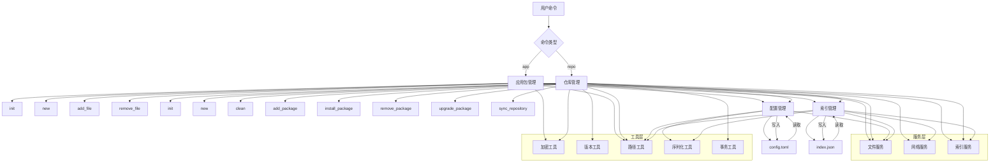

# pageos-pkgr 设计文档

## 概述

`pageos-pkgr` 是一个 Rust 编写的网页应用仓库管理程序，为 PageOS 提供软件包管理功能。

1. **核心功能模块**：专注业务逻辑
2. **通用服务模块**：提供跨领域能力
3. **工具模块**：实现基础能力复用
4. **数据模型**：统一数据结构

## 模块架构

### 核心功能模块

1. **应用包管理 (app)**

   - `init()`: 初始化应用包
     - 在指定目录初始化新的应用包
     - 创建必要的文件结构和 metadata.json 文件
     - 设置默认的包配置
   - `new()`: 创建新应用包
     - 创建以 package-id 命名的目录
     - 在目录内 `init()` 新的应用包
   - `add_file()`: 添加文件到包清单
     - `file_hash()` 计算指定文件的 SHA256 哈希值
     - 将文件路径和哈希值添加到 metadata.json 的 all_files 字段
     - 支持递归添加目录内的所有文件
   - `remove_file()`: 从包清单移除文件
     - 从 metadata.json 的 all_files 字段中移除指定文件或目录（内所有文件）的条目
     - 支持递归移除目录内的所有文件

2. **仓库管理 (repo)**

   - `init()`: 初始化仓库
     - 在指定目录创建仓库的基本结构
     - 创建 packages/ 目录
     - 初始化 config.toml 配置文件
     - 创建 index.json 索引文件
   - `new()`: 创建新的仓库
     - 创建以仓库名命名的目录
     - 在目录内 `init()` 仓库
   - `clean()`: 清理仓库
     - 清空下载缓存目录
     - 清理旧版本的软件包
     - 清空索引的 source 部分
   - `add_package()`: 添加包到仓库
     - 从本地应用包目录复制文件到仓库的 packages/ 目录
     - 更新版本信息，维护版本清单 (versions.txt)
     - 更新已安装软件索引 (index.json)
   - `install_package()`: 安装软件包
     - 从配置的软件源下载指定版本的应用程序文件（即软件源中对应的软件包的 metadata.json 的 all_files 中的文件）
     - 根据对应 metadata.json all_files 中的 SHA256 验证下载文件的完整性
     - `add_package()` 添加包到仓库
   - `remove_package()`: 卸载软件包
     - 从本地仓库删除指定版本的应用包
     - 更新版本信息，维护版本清单 (versions.txt)
     - 更新已安装软件索引
     - 如果没有其他版本保留，则删除整个包目录
   - `upgrade_package()`: 升级包
     - 检查指定包是否有可用更新
     - 用 `install_package()` 下载并安装新版本
     - 保留旧版本以便回滚
   - `sync_repository()`: 同步仓库
     - 增量同步：从其他软件源 `install_package()` 新增和更新的包
     - 镜像同步：完全同步其他软件源的内容，保持一致

3. **配置管理 (config)**

   - `load()`: 加载配置
     - 读取 config.toml 文件
     - 解析软件源配置
     - 验证配置的有效性
   - `save()`: 保存配置
     - 将配置对象序列化为 TOML 格式
     - 写入 config.toml 文件
     - 确保文件权限安全
   - `manage_source()`: 管理软件源
     - 添加新的软件源
     - 启用/禁用软件源
     - 删除软件源
     - 更新软件源信息

### 通用服务模块

4. **文件服务 (fsxg)**

   - `create_directory()`: 创建目录
   - `copy_directory()`: 复制目录
   - `remove_directory()`: 移除目录
   - `get_directory_files()`: 获取目录文件列表

5. **网络服务 (net)**

   - `download_file()`: 下载文件
   - `fetch_index()`: 获取索引
   - `mirror_sync()`: 镜像同步

6. **索引服务 (index)**

   - `update_source_index()`: 更新源索引
   - `update_local_index()`: 更新本地索引
   - `query()`: 索引查询
   - `generate_global_index()`: 生成全局索引

### 工具模块

7. **验证工具 (crypto)**

   - `file_hash()`: 文件哈希计算
   - `verify_file()`: 文件验证

8. **版本工具 (version)**

   - `compare()`: 版本比较
     - 比较两个版本所在 version.txt 的行号（越高越新）
   - `get_latest()`: 获取最新版本
   - `parse()`: 版本解析

9. **路径工具 (path)**

   - `get_config_path()`: 获取配置路径
   - `get_cache_dir()`: 获取缓存目录
   - `resolve_path()`: 解析路径

10. **序列化工具 (serde_utils)**

    - `load_toml()`: 加载 TOML 配置
    - `save_toml()`: 保存 TOML 配置
    - `load_json()`: 加载 JSON 配置
    - `save_json()`: 保存 JSON 配置

11. **事务工具 (transaction)**

### 数据模型

12. **元数据模型 (metadata)**

    - `PackageMetadata`: 包元数据
    - `FileManifest`: 文件清单
    - `VersionHistory`: 版本历史

13. **配置模型 (config_model)**

    - `RepositoryConfig`: 仓库配置
    - `SourceConfig`: 源配置

## 数据流图



## 设计原则优化

1. **分层架构**：

   - 核心层：业务功能实现
   - 服务层：跨领域能力
   - 工具层：基础能力复用

2. **单一职责**：

   - 每个模块/函数只做一件事
   - 功能边界明确无重叠

3. **依赖倒置**：

   - 高层模块不依赖低层实现细节
   - 通过抽象接口交互

4. **开闭原则**：

   - 模块对扩展开放
   - 对修改关闭

## 命令

- `pageos-pkgr app init <package-path>`：
  指定目录初始化软件包
- `pageos-pkgr app new <package-id>`：
  创建文件夹并在文件夹内初始化软件包
- `pageos-pkgr app add <path> --package <package-path>`：
  （默认所有非点开头文件和文件夹）添加文件或目录（内递归所有文件）入 `<package-path>/metadata.json` 的 `all_files`
- `pageos-pkgr app remove <path> --package <package-path>`：
  从 `<package-path>/metadata.json` 的 `all_files` 删除指定文件或目录

- `pageos-pkgr repo init <repo-path>`：
  指定目录初始化应用仓库
- `pageos-pkgr repo new <repo-name>`：
  创建文件夹并在文件夹内初始化应用仓库
- `pageos-pkgr repo clean --repo <repo-path>`：
  清空下载缓存、source 索引和旧版本软件包
- `pageos-pkgr repo update --repo <repo-path>`：
  更新索引 source 部分，并打印本地可更新的软件包
- @ `pageos-pkgr repo update local --repo <repo-path>`：
  更新索引 packages 部分
- @ `pageos-pkgr repo add <package-path> --repo <repo-path>`：
  （从软件包目录）添加新软件（或升级软件版本）到仓库
- @ `pageos-pkgr repo install <source-id>:<package-id>:<version> --repo <repo-path>`：
  （从源下载）覆盖安装软件（`<source-id>` 和 `<version>` 可省略）
- @ `pageos-pkgr repo remove <package-id>:<version> --repo <repo-path>`：
  写在已安装软件（`<version>` 可省略）
- @ `pageos-pkgr repo upgrade <package-id> --repo <repo-path>`：
  升级指定软件包（默认升级所有可升级软件包）
- @ `pageos-pkgr repo sync <source-id> --repo <repo-path>`：
  从其它软件源增量同步（默认为所有源，`<source-id>` 可忽略）
- @ `pageos-pkgr repo sync mirror <source-id> --repo <repo-path>`：
  从其它软件源镜像同步（默认为第一个源）

> 一般 `pageos-pkgr app` 命令下 `--package <package-path>` 默认为 `.`（当前目录），可忽略；
> 一般 `pageos-pkgr repo` 命令下 `--repo <repo-path>` 默认为 `$HOME/.local/share/pageos/`，可忽略。
>
> `@` 表示该操作需要 y/N 确认，可添加 -y 参数跳过。

## 仓库结构

```plaintext
$HOME/.local/share/pageos/  # 仓库存储根目录
├── packages/               # 已安装的包
│   ├── pageos.settings-manager/
│   │   ├── 1.0.0/
│   │   │   ├── metadata.json
│   │   │   └── ...         # 应用文件
│   │   ├── 1.1.0/
│   │   └── versions.txt
│   └── %PACKAGE_ID%/
│       └── %VERSION%/
├── config.toml             # 软件源等设置（官方源、镜像源）
└── index.json              # 全局索引文件
```

## 软件包结构

```plaintext
.                           # 一般是该包的 package-id 命名的文件夹
├── ...                     # 应用文件
├── target/
│   └── package-id.zip.papk # 打包好出的软件包文件
├── .gitignore              # 忽略 target 文件夹
└── metadata.json           # 全局索引文件
```

## 配置文件格式说明

**config.toml** (软件源设置文件)：

```toml
# 缓存目录，存储下载的临时文件等
# 默认值由系统决定，通常位于 $HOME/.cache/pageos-pkgr/cache
cache_dir = "/home/username/.cache/pageos-pkgr/cache"

# 软件源列表
[[source]]
# 唯一标识符，用于命令行操作，例如: pageos-pkgr repo install pageos-official:settings-manager
id = "pageos-official"
# 显示名称
name = "PageOS 官方仓库"
# 仓库根 URL，必须以 / 结尾
url = "https://pageos-apps.pages.dev/"
# 是否启用此源 (默认: true)
enabled = true
# 是否强制使用 HTTPS (默认: true)
require_https = true

[[source]]
id = "community-beta"
name = "社区测试仓库"
# 也可以是本地目录路径
url = "/home/username/repos/community-beta/"
enabled = false
require_https = false

[[source]]
id = "private-internal"
name = "私有内部仓库"
url = "https://internal.example.com/repo/"
enabled = true
require_https = true
```

## 索引文件格式说明

**index.json** (全局索引文件)：

```json
{
  "packages": [ // 已安装的包列表
    {
      "id": "应用唯一标识",
      "name": "应用名称",
      "icon": "图标路径",
      "author": "作者",
      "latest_version": "最新版本号",
      "description": "应用描述",
      "location": "（如：packages/package-id/0.0.0/）"
    },
    ……
  ],
  "source": [ // 软件源列表（id 无重复、但可与已安装的包列表重复）
    {
      "id": "应用唯一标识",
      "name": "应用名称",
      "icon": "图标路径",
      "author": "作者",
      "latest_version": "最新版本号",
      "description": "应用描述",
      "location": "（如：https://raw.githubusercontent.com/swaybien/pageos-apps/refs/heads/master/packages/package-id/0.0.0/）"
    },
    ……
  ]
}
```

**metadata.json** (应用元数据文件)：

```json
{
  "name": "应用名称", // 如：PageOS 用户界面
  "id": "应用唯一标识", // 如：pageos-ui
  "version": "版本号", // 如：1.0.0、139402853dw3d3
  "description": "详细描述", // 如：PageOS 的用户界面实现示例
  "icon": "图标路径（相对于软件包）", // 如：icons/pageos-ui.png
  "author": "作者",
  "type": "应用类型",
  "category": "分类",
  "permissions": ["权限列表"],
  "entry": "入口文件", // 如：index.html
  "all_files": {
    "文件相对路径": "SHA256 哈希值", // （默认空）如：metadata.json: 1234567890abcdef1234567890abcdef1234567890abcdef1234567890abcdef
    ……
  }
}
```

**versions.txt** (版本清单):

并不是所有软件包的作者都会使用语义化版本，所以创建本表以递新记录版本号。

```plaintext
139402853dw3d3
124234564dw4d1
……
```

```plaintext
0.1.0
0.1.1
……
```
